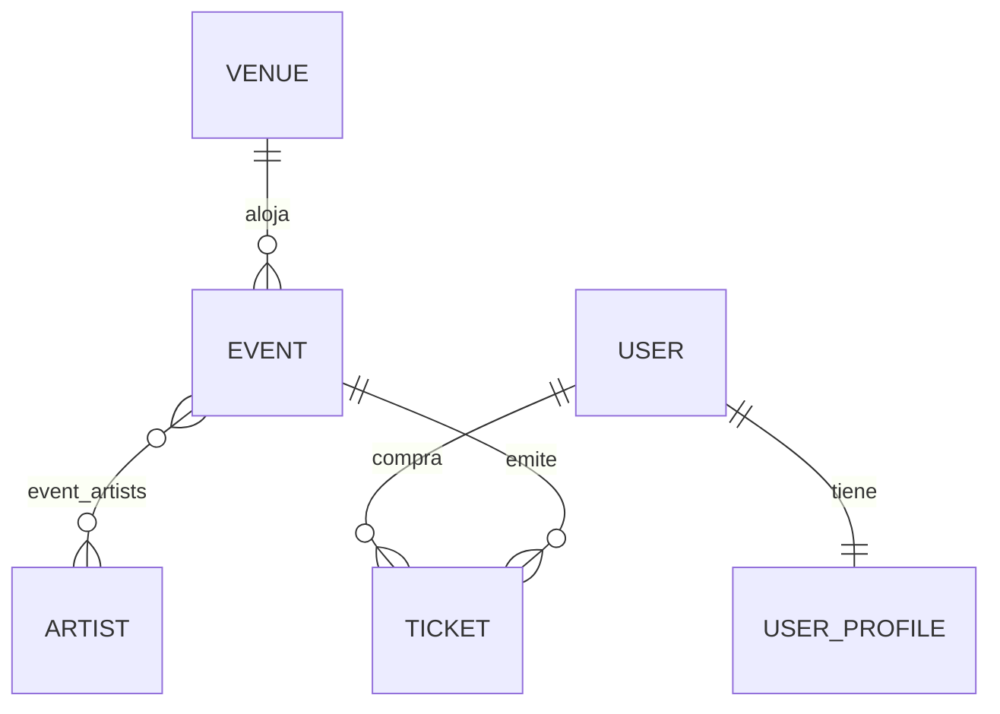

# PulsePass

Plataforma de descubrimiento y venta de tickets para eventos en vivo (conciertos, deportes, tecnología, cultura). Caso académico de persistencia con Spring Data JPA, Hibernate, PostgreSQL y Flyway.

## Stack
- Java 21
- Spring Boot 4.x + Maven
- Spring Data JPA / Hibernate (`ddl-auto=validate`)
- PostgreSQL (solo mediante Testcontainers en pruebas)
- Flyway (único responsable del esquema)

## Modelo de dominio



| Relación | Implementación |
|---|---|
| Venue 1:N Event | `Event.venue` (`@ManyToOne`, FK `venue_id` NOT NULL) |
| Event N:M Artist | `Event.artists` (`@ManyToMany`, tabla `event_artists` con PK compuesta) |
| User 1:1 UserProfile | `UserProfile.user` (`@OneToOne`, FK `user_id` UNIQUE); `User.profile` es el lado inverso |
| User 1:N Ticket / Event 1:N Ticket | `Ticket.user` y `Ticket.event` (`@ManyToOne`, ambas NOT NULL) |

### Decisiones de diseño
- **Ticket es una entidad** y no un `@ManyToMany` entre User y Event, porque tiene atributos propios (código, tipo, precio, estado, fecha de compra) y un usuario puede tener varios tickets del mismo evento.
- Los **enums** se guardan como texto (`@Enumerated(EnumType.STRING)`) y PostgreSQL los protege con `CHECK`.
- El **precio** es `BigDecimal` / `NUMERIC(12,2)`.
- La tabla de usuarios se llama `users` porque `user` es palabra reservada en PostgreSQL.
- No se usa Lombok `@Data` en las entidades.

## Migraciones (Flyway)
Ubicación: `src/main/resources/db/migration`. Una base vacía se reconstruye ejecutándolas en orden.

| Migración | Objetivo |
|---|---|
| `V1__create_schema.sql` | Crea `venues`, `artists`, `users`, `events`, `event_artists`, `user_profiles` y `tickets` con PK, FK, UNIQUE, CHECK e índices |
| `V2__insert_initial_artists.sql` | Inserta el catálogo inicial: Solar Beat, Neon Waves, Caribbean Sound, Ocean Drive y Digital Pulse |
| `V3__add_streaming_url_to_event.sql` | Agrega `streaming_url VARCHAR(500)` nullable a `events` sin modificar V1 |

**Regla:** una migración ya aplicada nunca se edita. Modificar V1 después de aplicarla rompe el checksum de Flyway en cualquier ambiente ya migrado. Por eso el campo `streaming_url` se agregó en V3.

### Restricciones reforzadas en PostgreSQL
UNIQUE en `venues.code`, `events.event_code`, `artists.stage_name`, `users.username`, `users.email`, `user_profiles.user_id` y `tickets.ticket_code`; CHECK en `venues.capacity > 0`, `events.minimum_age >= 0`, `tickets.price >= 0` y en los valores de los enums; FK entre todas las relaciones.

## Consultas

| Necesidad | Repository | Mecanismo | Justificación |
|---|---|---|---|
| Entidad por ID | `JpaRepository` | Método heredado | Ya lo provee Spring Data |
| Evento por `eventCode` | `EventRepository.findByEventCode` | Query Method | Filtro simple por un campo |
| Usuario por email sin distinguir mayúsculas | `UserRepository.findByEmailIgnoreCase` | Query Method | Un solo campo con `IgnoreCase` |
| Eventos publicados por fecha | `EventRepository.findByStatusOrderByEventDateAsc` | Query Method | Filtro y orden simples |
| Eventos de un venue por `venue.code` | `EventRepository.findByVenue_Code` | Query Method | Navega una relación sin joins explícitos |
| Tickets de un usuario por email y estado | `TicketRepository.findByUser_EmailAndStatus` | Query Method | Navega `Ticket -> User` |
| Tickets PAID por `eventCode` | `TicketRepository.findByEvent_EventCodeAndStatus` | Query Method | Dos condiciones simples, sin joins |
| Eventos por artista | `EventRepository.findEventsByArtistStageName` | `@Query` JPQL con JOIN | Recorre la tabla `N:M`; `DISTINCT` evita repetidos |
| Conteo de tickets PAID | `TicketRepository.countPaidByEventCode` | `@Query` JPQL con COUNT | Agregación |
| Eventos por ciudad y artista | `EventRepository.findEventsByCityAndArtist` | `@Query` JPQL con varias asociaciones | Une venue y artistas |
| Eventos recomendados | `EventRepository.findRecommendedEvents` | `@Query` JPQL con filtros, DISTINCT y orden | Combina estado, fecha, ciudad y texto del artista |
| Tickets de eventos futuros | `TicketRepository.findTicketsOfEventsAfter` | `@Query` JPQL con JOIN y orden | Ordena por un campo de otra entidad |

No se usa SQL nativo. Regla aplicada: consultas simples con Query Methods, consultas complejas con JPQL legible.

## Pruebas
Todas son de integración y usan **PostgreSQL con Testcontainers** (no H2). Flyway construye el esquema y después se ejecutan repositories y consultas. Cada prueba corre en una transacción con rollback.

| Clase | Cubre |
|---|---|
| `FlywayMigrationIT` | Flyway aplica V1, V2 y V3; Hibernate en `validate` (QT-001, QT-002) |
| `VenuePersistenceTest` | Persistencia de Venue, UNIQUE de `code`, CHECK de capacidad |
| `EventRepositoryIT` | Venue 1:N Event, Query Methods, UNIQUE de `eventCode`, `streaming_url` (QT-003, QT-007) |
| `EventArtistIT` | Event N:M Artist, sin duplicados, consulta por artista (QT-005) |
| `UserProfileIT` | User 1:1 UserProfile, UNIQUE de username, email y perfil (QT-004, QT-009) |
| `TicketRepositoryIT` | Ticket -> User y Ticket -> Event, conteo PAID, CHECK de precio (QT-006, QT-008) |
| `EventSearchIT` | Consultas JPQL de descubrimiento (QT-008) |

## Cómo ejecutar
Requisitos: JDK 21 y **Docker corriendo** (Testcontainers lo necesita).

```bash
# Windows (PowerShell)
.\mvnw clean test

# Linux / macOS
./mvnw clean test
```

Debe terminar con `BUILD SUCCESS`. No hace falta instalar PostgreSQL: el contenedor se crea solo.

Para arrancar la aplicación con una base de datos temporal, ejecuta `TestPulsepassApplication` desde el IDE.

## Preguntas del equipo
1. **¿Por qué Ticket es entidad?** Porque guarda datos propios y permite varios tickets del mismo usuario para un mismo evento.
2. **¿Qué va en PostgreSQL y qué en una capa Service?** En PostgreSQL: unicidad, referencias, rangos y NOT NULL. En Service (a futuro): transiciones de estado, cálculo de `SOLD_OUT`, control de capacidad y reglas como edad mínima frente a fecha de nacimiento.
3. **¿Query Method o JPQL?** Query Method para filtros simples y navegación de una relación; JPQL cuando hay joins múltiples, `DISTINCT`, `COUNT` u ordenamientos por otra entidad.
4. **¿Qué pasa si se modifica V1 ya aplicada?** Flyway detecta que el checksum cambió y falla en cualquier base ya migrada. Los cambios estructurales van en una nueva migración.
5. **¿Qué oculta H2?** Diferencias de dialecto, de tipos, del comportamiento de `CHECK`, de secuencias y de sensibilidad a mayúsculas frente a PostgreSQL.
6. **¿Cómo evitar sobreventa?** Con una tabla de inventario por evento y tipo de ticket, restricción `stock >= 0` y control de concurrencia (bloqueo optimista con `@Version` o bloqueo pesimista).