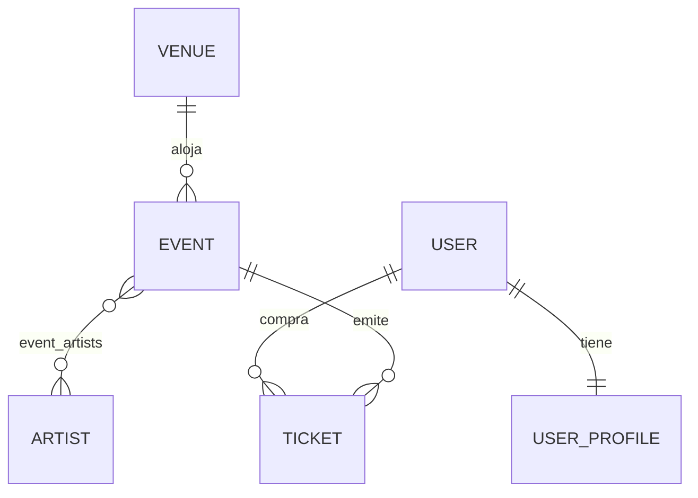

# PulsePass

Plataforma de descubrimiento y venta de tickets para eventos en vivo (conciertos, deportes, tecnología, cultura). Caso académico desarrollado por fases: **Persistencia** (Spring Data JPA, Hibernate, PostgreSQL, Flyway), **Servicios** (reglas de negocio) y **Controladores REST** (API HTTP).

## Stack
- Java 21
- Spring Boot 4.x + Maven
- MapStruct (Entity -> DTO) y DTOs como `record`
- Spring MVC + Bean Validation (capa REST)
- Spring Data JPA / Hibernate (`ddl-auto=validate`)
- PostgreSQL (solo mediante Testcontainers en pruebas de persistencia)
- Flyway (único responsable del esquema)
- JUnit 5, Mockito y AssertJ para las pruebas unitarias de Service
- MockMvc (`@WebMvcTest`) para las pruebas de Controller

## Arquitectura por capas

```
Cliente HTTP -> Controller -> Service -> Repository -> PostgreSQL
                    |
          GlobalExceptionHandler  (excepciones -> ErrorResponse JSON)
```

| Capa | Responsabilidad |
|---|---|
| Controller | Solo asuntos HTTP: rutas, verbos, validación estructural y códigos de estado. Delega todo al Service |
| Service | Reglas de negocio, validaciones, transacciones (`@Transactional`) y mapeo a DTOs con MapStruct |
| Repository | Acceso a datos |

Reglas de la capa Controller: no accede a `Repository`, no implementa reglas de negocio, no expone entidades JPA (solo DTOs) y no repite `try/catch` (el manejo de errores es centralizado).

## Modelo de dominio


```mermaid
erDiagram
    VENUE ||--o{ EVENT : "aloja"
    EVENT }o--o{ ARTIST : "event_artists"
    USER ||--|| USER_PROFILE : "tiene"
    USER ||--o{ TICKET : "compra"
    EVENT ||--o{ TICKET : "emite"
```

| Relación | Implementación |
|---|---|
| Venue 1:N Event | `Event.venue` (`@ManyToOne`, FK `venue_id` NOT NULL) |
| Event N:M Artist | `Event.artists` (`@ManyToMany`, tabla `event_artists` con PK compuesta) |
| User 1:1 UserProfile | `UserProfile.user` (`@OneToOne`, FK `user_id` UNIQUE); `User.profile` es el lado inverso |
| User 1:N Ticket / Event 1:N Ticket | `Ticket.user` y `Ticket.event` (`@ManyToOne`, ambas NOT NULL) |

### Decisiones de diseño
- **Ticket es una entidad** y no un `@ManyToMany` entre User y Event, porque tiene atributos propios (código, tipo, precio, estado, fecha de compra) y un usuario puede tener varios tickets del mismo evento.
- Los **enums** se guardan como texto (`@Enumerated(EnumType.STRING)`) y PostgreSQL los protege con `CHECK`.
- El **precio** es `BigDecimal` / `NUMERIC(12,2)`.
- La tabla de usuarios se llama `users` porque `user` es palabra reservada en PostgreSQL.
- No se usa Lombok `@Data` en las entidades.

## Migraciones (Flyway)
Ubicación: `src/main/resources/db/migration`. Una base vacía se reconstruye ejecutándolas en orden.

| Migración | Objetivo |
|---|---|
| `V1__create_schema.sql` | Crea `venues`, `artists`, `users`, `events`, `event_artists`, `user_profiles` y `tickets` con PK, FK, UNIQUE, CHECK e índices |
| `V2__insert_initial_artists.sql` | Inserta el catálogo inicial: Solar Beat, Neon Waves, Caribbean Sound, Ocean Drive y Digital Pulse |
| `V3__add_streaming_url_to_event.sql` | Agrega `streaming_url VARCHAR(500)` nullable a `events` sin modificar V1 |

**Regla:** una migración ya aplicada nunca se edita. Modificar V1 después de aplicarla rompe el checksum de Flyway en cualquier ambiente ya migrado. Por eso el campo `streaming_url` se agregó en V3.

### Restricciones reforzadas en PostgreSQL
UNIQUE en `venues.code`, `events.event_code`, `artists.stage_name`, `users.username`, `users.email`, `user_profiles.user_id` y `tickets.ticket_code`; CHECK en `venues.capacity > 0`, `events.minimum_age >= 0`, `tickets.price >= 0` y en los valores de los enums; FK entre todas las relaciones.

## Consultas

| Necesidad | Repository | Mecanismo | Justificación |
|---|---|---|---|
| Entidad por ID | `JpaRepository` | Método heredado | Ya lo provee Spring Data |
| Evento por `eventCode` | `EventRepository.findByEventCode` | Query Method | Filtro simple por un campo |
| Usuario por email sin distinguir mayúsculas | `UserRepository.findByEmailIgnoreCase` | Query Method | Un solo campo con `IgnoreCase` |
| Eventos publicados por fecha | `EventRepository.findByStatusOrderByEventDateAsc` | Query Method | Filtro y orden simples |
| Eventos de un venue por `venue.code` | `EventRepository.findByVenue_Code` | Query Method | Navega una relación sin joins explícitos |
| Tickets de un usuario por email y estado | `TicketRepository.findByUser_EmailAndStatus` | Query Method | Navega `Ticket -> User` |
| Tickets PAID por `eventCode` | `TicketRepository.findByEvent_EventCodeAndStatus` | Query Method | Dos condiciones simples, sin joins |
| Eventos por artista | `EventRepository.findEventsByArtistStageName` | `@Query` JPQL con JOIN | Recorre la tabla `N:M`; `DISTINCT` evita repetidos |
| Conteo de tickets PAID | `TicketRepository.countPaidByEventCode` | `@Query` JPQL con COUNT | Agregación |
| Eventos por ciudad y artista | `EventRepository.findEventsByCityAndArtist` | `@Query` JPQL con varias asociaciones | Une venue y artistas |
| Eventos recomendados | `EventRepository.findRecommendedEvents` | `@Query` JPQL con filtros, DISTINCT y orden | Combina estado, fecha, ciudad y texto del artista |
| Tickets de eventos futuros | `TicketRepository.findTicketsOfEventsAfter` | `@Query` JPQL con JOIN y orden | Ordena por un campo de otra entidad |

No se usa SQL nativo. Regla aplicada: consultas simples con Query Methods, consultas complejas con JPQL legible.

## Capa de Servicios (Fase 2)

Los Services son la frontera entre la API y el modelo persistente: aplican las reglas de negocio, coordinan repositories, controlan transacciones, transforman entidades a DTOs y lanzan errores de dominio claros. Cada servicio tiene interfaz e implementación (`EventService` / `EventServiceImpl`), usa inyección por constructor y **nunca retorna entidades JPA**.

### Servicios y operaciones

| Servicio | Operaciones |
|---|---|
| `VenueService` | `findByCode`, `findActiveVenues` |
| `EventService` | `create`, `findByCode`, `findPublishedEvents`, `publish`, `addArtist`, `findByArtist` |
| `ArtistService` | `findById`, `findByStageName`, `findActiveArtists` |
| `UserService` | `register`, `findByEmail`, `findByUsername` |
| `TicketService` | `purchase`, `findByCode`, `findByUserEmail`, `findPaidTicketsByEvent`, `cancel`, `markAsUsed` |

Total: 20 operaciones públicas.

### DTOs y mapeo
- **Request** (`record`): `CreateEventRequest`, `RegisterUserRequest`, `PurchaseTicketRequest`.
- **Response** (`record`): `VenueResponse`, `EventResponse`, `EventSummaryResponse`, `ArtistResponse`, `UserResponse`, `TicketResponse`.
- **MapStruct** (`@Mapper(componentModel = "spring")`) para Entity -> DTO. Por ejemplo, `EventMapper` mapea `venue.code` a `venueCode` y `venue.name` a `venueName`; `TicketMapper` mapea `user.email`, `event.eventCode` y `event.name` a `userEmail`, `eventCode` y `eventName`.
- El precio del ticket **no** lo envía el cliente: lo calcula el sistema con `BigDecimal` y nunca puede ser negativo.

### Reglas de negocio

| Área | Regla | Error |
|---|---|---|
| Venue | Venue inexistente; `findActiveVenues` solo devuelve `active = true` | `ResourceNotFoundException` |
| Evento (crear) | `eventCode` único | `DuplicateResourceException` |
| Evento (crear) | `venueCode` debe existir | `ResourceNotFoundException` |
| Evento (crear) | Venue activo, fecha futura, `minimumAge >= 0` | `BusinessRuleException` |
| Evento (crear) | Todo evento nuevo inicia en `DRAFT` (el request no lo controla) | - |
| Evento (publicar) | Solo `DRAFT -> PUBLISHED`, con fecha futura y venue activo | `BusinessRuleException` |
| Evento (artistas) | No repetir artista en un evento; no agregar a eventos `CANCELLED` o `FINISHED` | `BusinessRuleException` |
| Artista | Artista inexistente; `findActiveArtists` solo devuelve activos | `ResourceNotFoundException` |
| Usuario | `username` único y email único sin distinguir mayúsculas | `DuplicateResourceException` |
| Usuario | Inicia con `active = true`; `birthDate` no puede ser futura | `BusinessRuleException` (fecha) |
| Usuario | `User` y `UserProfile` se crean en la misma transacción | - |
| Ticket (compra) | Usuario y evento deben existir | `ResourceNotFoundException` |
| Ticket (compra) | Usuario activo; evento `PUBLISHED` y con fecha futura | `BusinessRuleException` |
| Ticket (compra) | Edad mínima evaluada **en la fecha del evento** con `UserProfile.birthDate` | `BusinessRuleException` |
| Ticket (compra) | Capacidad: `paidTickets < venue.capacity` | `BusinessRuleException` |
| Ticket (compra) | Si la compra completa el cupo, el evento pasa a `SOLD_OUT` en la misma transacción | - |
| Ticket (cancelar) | Solo `PAID -> CANCELLED`, y antes de la fecha del evento; no cancelar `USED` ni `CANCELLED` | `BusinessRuleException` |
| Ticket (usar) | Solo `PAID -> USED`; un `CANCELLED` nunca puede usarse | `BusinessRuleException` |

### Ciclos de estado

```
Evento:  DRAFT -> PUBLISHED -> SOLD_OUT -> FINISHED
         DRAFT -> CANCELLED
         PUBLISHED -> CANCELLED

Ticket:  PAID -> USED
         PAID -> CANCELLED
```

### Transacciones
- Escrituras (`create`, `publish`, `addArtist`, `register`, `purchase`, `cancel`, `markAsUsed`): `@Transactional`.
- Lecturas (`findByCode`, `findPublishedEvents`, `findByUserEmail`, `findPaidTicketsByEvent`, etc.): `@Transactional(readOnly = true)`.
- La compra es **atómica**: valida usuario, evento, edad y capacidad, calcula el precio, crea el ticket y actualiza `SOLD_OUT`; si algún paso falla, hace rollback.

### Flujo de compra

```
PurchaseTicketRequest -> buscar User -> validar activo -> buscar Event -> validar PUBLISHED y fecha
  -> validar edad -> validar capacidad -> calcular precio -> crear Ticket -> guardar
  -> actualizar SOLD_OUT si aplica -> TicketMapper -> TicketResponse
```

### Excepciones
`ResourceNotFoundException` (el recurso no existe), `DuplicateResourceException` (conflicto de unicidad) y `BusinessRuleException` (el recurso existe pero la operación no es válida). Los `Optional` se manejan con `orElseThrow(...)`, nunca con `get()` sin comprobar.

### Limitación conocida
El conteo de tickets seguido del guardado es suficiente para el ejercicio académico, pero dos compras concurrentes podrían ver el mismo cupo disponible. En producción habría que usar bloqueo optimista o pesimista, actualizaciones atómicas o restricciones en base de datos.

## API REST (Fase 3)

La API expone los **20 métodos públicos** de los Services mediante cinco controllers. Todas las respuestas son DTOs en JSON; nunca entidades JPA.

### Venues — `VenueController`

| Método | Endpoint | Service | Éxito |
|---|---|---|---|
| GET | `/api/venues/{code}` | `findByCode` | 200 |
| GET | `/api/venues/active` | `findActiveVenues` | 200 |

### Eventos — `EventController`

| Método | Endpoint | Service | Éxito |
|---|---|---|---|
| POST | `/api/events` | `create` | 201 |
| GET | `/api/events/{eventCode}` | `findByCode` | 200 |
| GET | `/api/events/published` | `findPublishedEvents` | 200 |
| PATCH | `/api/events/{eventCode}/publish` | `publish` | 200 |
| POST | `/api/events/{eventCode}/artists/{artistId}` | `addArtist` | 200 |
| GET | `/api/events/by-artist?stageName=...` | `findByArtist` | 200 |
| GET | `/api/events/{eventCode}/tickets/paid` | `TicketService.findPaidTicketsByEvent` | 200 |

### Artistas — `ArtistController`

| Método | Endpoint | Service | Éxito |
|---|---|---|---|
| GET | `/api/artists/{id}` | `findById` | 200 |
| GET | `/api/artists/by-stage-name?stageName=...` | `findByStageName` | 200 |
| GET | `/api/artists/active` | `findActiveArtists` | 200 |

### Usuarios — `UserController`

| Método | Endpoint | Service | Éxito |
|---|---|---|---|
| POST | `/api/users` | `register` | 201 |
| GET | `/api/users/by-email?email=...` | `findByEmail` | 200 |
| GET | `/api/users/by-username?username=...` | `findByUsername` | 200 |

### Tickets — `TicketController`

| Método | Endpoint | Service | Éxito |
|---|---|---|---|
| POST | `/api/tickets` | `purchase` | 201 |
| GET | `/api/tickets/{ticketCode}` | `findByCode` | 200 |
| GET | `/api/tickets/by-user?email=...` | `findByUserEmail` | 200 |
| PATCH | `/api/tickets/{ticketCode}/cancel` | `cancel` | 200 |
| PATCH | `/api/tickets/{ticketCode}/use` | `markAsUsed` | 200 |

### Validación de entrada (Bean Validation)

| Request | Validaciones principales |
|---|---|
| `CreateEventRequest` | `eventCode`, `name`, `venueCode` `@NotBlank`; `category`, `eventDate` `@NotNull`; `minimumAge` `@NotNull` y `@Min(0)`; longitud máxima en `description` |
| `RegisterUserRequest` | `username`, `firstName`, `lastName` `@NotBlank`; `email` `@NotBlank` y `@Email`; `birthDate` `@NotNull` |
| `PurchaseTicketRequest` | `userEmail` `@NotBlank` y `@Email`; `eventCode` `@NotBlank`; `type` `@NotNull` |

Un request inválido responde 400 **sin llegar al Service**. Las asociaciones se expresan con identificadores de negocio (por ejemplo `"venueCode": "VEN-SMR-01"`), no con objetos JPA.

### Manejo de errores

Un único `GlobalExceptionHandler` (`@RestControllerAdvice`) convierte las excepciones en un `ErrorResponse` uniforme:

```json
{
  "timestamp": "2026-10-04T20:00:00",
  "status": 404,
  "error": "Not Found",
  "message": "Event not found: CMF-2026",
  "details": {}
}
```

En errores de validación, `details` contiene un mapa `campo -> mensaje`.

| Excepción / condición | HTTP |
|---|---|
| `MethodArgumentNotValidException` | 400 |
| JSON mal formado | 400 |
| `ResourceNotFoundException` | 404 |
| `DuplicateResourceException` | 409 |
| `BusinessRuleException` | 409 |
| Excepción inesperada | 500 (sin stack traces ni detalles internos) |

### Estructura

```
src/main/java/com/pulsepass
├── domain       entidades y enums
├── repository   acceso a datos
├── dto          request/ (CreateEvent, RegisterUser, PurchaseTicket) y response/ (incluye ErrorResponse)
├── mapper       mappers MapStruct
├── exception    ResourceNotFound, DuplicateResource, BusinessRule y GlobalExceptionHandler
├── service      interfaces Service
│   └── impl     implementaciones @Service
└── controller   Venue, Event, Artist, User y TicketController

src/test/java/com/pulsepass
├── service      pruebas unitarias de Service
└── controller   VenueControllerTest, EventControllerTest, ArtistControllerTest, UserControllerTest, TicketControllerTest
```

## Pruebas

### Persistencia (integración)
Usan **PostgreSQL con Testcontainers** (no H2). Flyway construye el esquema y después se ejecutan repositories y consultas. Cada prueba corre en una transacción con rollback.

| Clase | Cubre |
|---|---|
| `FlywayMigrationIT` | Flyway aplica V1, V2 y V3; Hibernate en `validate` (QT-001, QT-002) |
| `VenuePersistenceTest` | Persistencia de Venue, UNIQUE de `code`, CHECK de capacidad |
| `EventRepositoryIT` | Venue 1:N Event, Query Methods, UNIQUE de `eventCode`, `streaming_url` (QT-003, QT-007) |
| `EventArtistIT` | Event N:M Artist, sin duplicados, consulta por artista (QT-005) |
| `UserProfileIT` | User 1:1 UserProfile, UNIQUE de username, email y perfil (QT-004, QT-009) |
| `TicketRepositoryIT` | Ticket -> User y Ticket -> Event, conteo PAID, CHECK de precio (QT-006, QT-008) |
| `EventSearchIT` | Consultas JPQL de descubrimiento (QT-008) |

### Servicios (unitarias)
Prueban el Service real con repositories y mappers simulados con Mockito (`@ExtendWith(MockitoExtension.class)`) y aserciones con AssertJ. No usan `@SpringBootTest`, PostgreSQL ni Testcontainers, y siguen el patrón ARRANGE / ACT / ASSERT. Usan `when(...)`, `verify(...)` y `verify(..., never())` en los caminos inválidos (por ejemplo, que `save()` nunca se ejecute).

| Clase | Escenarios cubiertos |
|---|---|
| `EventServiceImplTest` | Evento existente e inexistente, crear válido, venue inexistente o inactivo, fecha pasada, publicar `DRAFT` válido y publicar `CANCELLED` (sin persistir) |
| `UserServiceImplTest` | Registro válido, username duplicado, email duplicado, fecha de nacimiento futura |
| `TicketServiceImplTest` | Compra válida (`PAID`), usuario inexistente o inactivo, evento `DRAFT` o `CANCELLED`, menor de edad, sin capacidad, último ticket (`SOLD_OUT`), cancelar `PAID` y `USED`, usar `PAID` y `CANCELLED` |

### Controllers (contrato HTTP)
Usan `@WebMvcTest` + `MockMvc`, con los Services reemplazados por `@MockitoBean`. No levantan PostgreSQL ni el contexto completo, así que son rápidas y deterministas. Verifican status HTTP, `Content-Type`, campos JSON con `jsonPath` y la interacción con el Service (`verify(...)`; `verify(..., never())` cuando el request es inválido).

| Clase | Escenarios cubiertos |
|---|---|
| `VenueControllerTest` | Venue existente 200, inexistente 404, activos 200 |
| `EventControllerTest` | Crear 201, request inválido 400, consultar 200/404, publicados 200, publicar 200/409, asociar artista 200, buscar por artista 200 |
| `ArtistControllerTest` | Por ID 200/404, por `stageName` 200, activos 200 |
| `UserControllerTest` | Registrar 201, email inválido 400, username duplicado 409, consulta por email y username 200 |
| `TicketControllerTest` | Compra 201, inválido 400, usuario inexistente 404, regla de negocio 409, consultas 200, cancelar y usar 200/409 |

## Cómo ejecutar
Requisitos: JDK 21 y **Docker corriendo** (Testcontainers lo necesita para las pruebas de persistencia; las de Controller no lo requieren).

```bash
# Windows (PowerShell)
.\mvnw clean test

# Linux / macOS
./mvnw clean test
```

Debe terminar con `BUILD SUCCESS`. No hace falta instalar PostgreSQL: el contenedor se crea solo.

Para arrancar la aplicación con una base de datos temporal, ejecuta `TestPulsepassApplication` desde el IDE y consume los endpoints en `http://localhost:8080` (puerto por defecto de Spring Boot).

Ejemplo:

```bash
curl http://localhost:8080/api/venues/VEN-SMR-01
```

## Preguntas del equipo
1. **¿Por qué Ticket es entidad?** Porque guarda datos propios y permite varios tickets del mismo usuario para un mismo evento.
2. **¿Qué va en PostgreSQL y qué en una capa Service?** En PostgreSQL: unicidad, referencias, rangos y NOT NULL. En Service: transiciones de estado, cálculo de `SOLD_OUT`, control de capacidad y reglas como edad mínima frente a fecha de nacimiento.
3. **¿Query Method o JPQL?** Query Method para filtros simples y navegación de una relación; JPQL cuando hay joins múltiples, `DISTINCT`, `COUNT` u ordenamientos por otra entidad.
4. **¿Qué pasa si se modifica V1 ya aplicada?** Flyway detecta que el checksum cambió y falla en cualquier base ya migrada. Los cambios estructurales van en una nueva migración.
5. **¿Qué oculta H2?** Diferencias de dialecto, de tipos, del comportamiento de `CHECK`, de secuencias y de sensibilidad a mayúsculas frente a PostgreSQL.
6. **¿Cómo evitar sobreventa?** Con una tabla de inventario por evento y tipo de ticket, restricción `stock >= 0` y control de concurrencia (bloqueo optimista con `@Version` o bloqueo pesimista).
7. **¿Qué pertenece al Controller y qué al Service?** Al Controller, lo HTTP: rutas, validación estructural y códigos de estado. Al Service, las reglas de negocio.
8. **¿Por qué el Controller no accede al Repository?** Porque saltaría las reglas y transacciones del Service y acoplaría la API al modelo de persistencia.
9. **¿Validación estructural o regla de negocio?** Estructural: campo obligatorio, formato de email, longitud, mínimo (Bean Validation, 400). De negocio: edad mínima, capacidad, estado del evento, duplicados (Service, 404/409).
10. **¿Cuándo 400, 404 y 409?** 400: request inválido o mal formado. 404: el recurso no existe. 409: duplicado o regla de negocio incumplida.
11. **¿Por qué `@WebMvcTest` y no `@SpringBootTest`?** Carga solo la capa web, sin base de datos, y permite probar el contrato HTTP de forma aislada y rápida.
12. **¿Cómo comprobar que un request inválido no invoca el Service?** Con `verify(service, never())` tras una petición que falla en Bean Validation.
13. **¿Por qué el Service no retorna entidades JPA?** Para no acoplar los clientes al modelo persistente ni exponer relaciones perezosas; se usan DTOs (`record`) mapeados con MapStruct.
14. **¿Por qué la compra debe ser atómica?** Porque validar, crear el ticket y actualizar `SOLD_OUT` deben ocurrir juntos; si algo falla, todo se revierte.
15. **¿Por qué la capacidad y el cálculo de edad son reglas de Service?** Porque dependen de varios datos (venue, tickets pagados, perfil del usuario, fecha del evento) y no son restricciones de una sola tabla.
16. **¿Por qué `BigDecimal` para precios?** Evita los errores de redondeo de `double` en dinero.
17. **¿Qué demuestra `verify(repository, never()).save(...)`?** Que un camino inválido falló antes de persistir nada.
18. **¿`ResourceNotFoundException` o `BusinessRuleException`?** La primera cuando el recurso no existe; la segunda cuando existe pero la operación no es válida.
19. **¿Cuándo `@Transactional` y cuándo `readOnly = true`?** `@Transactional` en escrituras; `readOnly = true` en consultas.